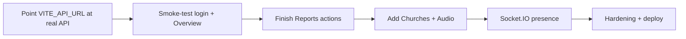

# Jevah Admin Dashboard — Build Status & Roadmap

Last updated: 20 July 2026

This document describes what we built in the **jevahapp web** frontend, how it maps to the **Frontend Admin Guide**, what is still missing, and recommended next steps.

---

## 1. Context

| Layer | Status |
|-------|--------|
| Marketing site (React + Vite + Tailwind) | Existing — cloned and running |
| Mobile nav redesign + Login entry | **Done** |
| Admin auth (JWT email/password + role gate) | **Done** (frontend) |
| Admin dashboard screens | **Partial** — core screens live |
| Backend `/api/auth` + `/api/admin` | **Assumed external** — not in this repo |
| Churches + Audio library admin | **Not started** |
| Socket.IO presence live connection | **Not started** (presence is polled via REST only) |

API base URL is configured in `.env`:

```env
VITE_API_URL=http://localhost:3001/api
```

All admin calls use `Authorization: Bearer <accessToken>`.

---

## 2. What we built (frontend)

### 2.1 Public site — navigation

**File:** `src/sections/Nav.tsx`

- Redesigned mobile menu: compact header + floating menu card (not the old full-height side drawer)
- **Login** button on mobile and desktop
- **Download App** CTA retained
- Login and admin routes do **not** show marketing Nav/Footer

### 2.2 Auth & session

| Piece | Path | Role |
|-------|------|------|
| API client | `src/lib/api.ts` | Base URL, Bearer header, errors, token helpers |
| Auth API | `src/services/authApi.ts` | `login`, `me`, `logout`, `refresh` |
| Auth context | `src/context/AuthContext.tsx` | Session boot, role gate, login/logout |
| Guard | `src/components/ProtectedRoute.tsx` | Blocks non-admins from `/admin/*` |
| Login UI | `src/pages/Login.tsx` | Email / password / remember me |

**Flow (matches the guide):**

1. `POST /api/auth/login`
2. Require `user.role === "admin"`
3. Store `accessToken` + `adminUser` in `localStorage`
4. On refresh: `GET /api/auth/me` → if not admin or 401 → clear / try refresh → `/login`
5. Logout: `POST /api/auth/logout` + clear local session

### 2.3 Admin shell & routes

**Shell:** `src/pages/admin/AdminShell.tsx`  
**Wiring:** `src/App.tsx`

| Route | Screen | File |
|-------|--------|------|
| `/login` | Admin sign-in | `src/pages/Login.tsx` |
| `/admin` | Overview | `src/pages/admin/Overview.tsx` |
| `/admin/users` | Users + ban / verify / email | `src/pages/admin/Users.tsx` |
| `/admin/reports` | Reports inbox | `src/pages/admin/Reports.tsx` |
| `/admin/moderation` | Moderation queue | `src/pages/admin/Moderation.tsx` |
| `/admin/email` | Compose email | `src/pages/admin/ComposeEmail.tsx` |
| `/admin/activity` | Activity audit | `src/pages/admin/Activity.tsx` |

**Admin API helpers:** `src/services/adminApi.ts`  
**Types:** `src/types/admin.ts`

### 2.4 Overview dashboard behaviour

On `/admin` load (and every ~45s), parallel fetches:

- `GET /api/admin/dashboard/analytics` → KPI cards
- `GET /api/admin/dashboard/feed` → activity stream
- `GET /api/admin/users/presence?status=online` → online strip + badge
- `GET /api/admin/media/recent` → latest uploads
- `GET /api/admin/moderation/queue` → “on review” preview

KPI deep links go to Users / Reports / Moderation as described in the guide.

---

## 3. Map to the Frontend Admin Guide

### Guide §1 — Login flow

| Guide item | Status |
|------------|--------|
| Email/password JWT login | Done |
| Admin-only role gate | Done |
| `localStorage` token + user | Done |
| `GET /api/auth/me` on boot | Done |
| Refresh on 401 | Scaffolded (`refreshSession`) |
| Socket.IO after login | **Not done** |
| Logout + redirect | Done |

### Guide §2 — Landing dashboard

| Guide item | Status |
|------------|--------|
| Analytics KPIs | Done |
| Activity feed | Done |
| Online strip | Done (REST) |
| Recent uploads | Done |
| Moderation preview | Done |
| 30–60s polling | Done (~45s) |

### Guide §3 — Recommended screens

| Screen | Status | Notes |
|--------|--------|-------|
| Login | Done | |
| Overview | Done | |
| Users | Done | List, filters, ban, verification toggles, multi-select email |
| Compose email | Done | Standalone page + modal from Users |
| Reports | Partial | List + filters; **action buttons** (dismiss / resolve / delete / ban) not wired yet |
| Moderation | Done | Approve / reject / hard delete |
| Churches | **Not started** | Needs church CRUD + verification from `ADMIN.md` |
| Audio library | **Not started** | Needs `/api/audio/copyright-free` CRUD details |
| Activity | Done | List of admin actions |

### Guide §4–7 — Users, uploads, reports, QA

| Capability | Status |
|------------|--------|
| Users list + `isOnline` | Done (from API fields) |
| Presence filter (online/offline) | Done |
| Ban + verification PATCH | Done |
| `POST /api/admin/email` | Done |
| Recent media + moderation PATCH/DELETE | Done |
| Reports list | Done |
| Report resolve / hide / delete / ban uploader | **Not done** — need exact endpoints from `ADMIN.md` |
| End-to-end QA path (mobile report → admin action → notify) | Backend-dependent; UI actions incomplete |

### Guide §8 — Error handling

| Status | UI behaviour today |
|--------|--------------------|
| 401 | Session clear / re-login via guard |
| 403 / not admin | Login error or redirect |
| 400 / other | Toast / inline error messages |
| 404 row remove | Partial (moderation deletes remove row) |

### Guide §9 — Suggested structure

Matches closely:

```
AdminApp
├── LoginPage                 ✅
├── AdminShell                ✅
│   └── OnlineCountBadge      ✅ (sidebar / mobile header)
├── OverviewPage              ✅
├── UsersPage                 ✅
├── ReportsPage               ⚠️ list only
├── ModerationQueuePage       ✅
├── ComposeEmail              ✅
├── ActivityPage              ✅
├── ChurchesPage              ❌
└── AudioLibraryPage          ❌
```

---

## 4. What you already have (backend / product) vs this repo

From the guide, the **Mongo + `/api/admin` stack** is already defined (and presumably running elsewhere):

- Same `User` collection for mobile + web
- `role: "admin"` unlocks dashboard
- Analytics, feed, presence, moderation, reports, email, activity APIs

**This repo only contains the web UI.** There is no `server/` folder here. The dashboard will only work end-to-end when:

1. Backend is reachable at `VITE_API_URL`
2. CORS allows `http://localhost:5173` (and production domain)
3. An admin user exists in Mongo (`role: "admin"`)

Marketing forms (newsletter / contact) were already in the site and are still separate from admin APIs (see `BACKEND_API_DOCUMENTATION.md`).

---

## 5. What’s next (priority order)

### P0 — Make login + overview work against real API

1. Set production/staging `VITE_API_URL` in `.env` / Vercel env
2. Confirm CORS + admin user credentials
3. Smoke-test: login → Overview KPIs → Users → Moderation
4. Align response shapes if backend wraps data differently (helpers already tolerate several list keys: `data`, `users`, `items`, etc.)

### P1 — Finish Reports actions

Wire report row actions from `ADMIN.md`, for example:

- Media: dismiss / reviewed / resolve (hide) / delete / ban uploader
- Comments: hide / unhide / dismiss

Until this is done, Reports is an inbox viewer only.

### P2 — Churches + Audio library

Add pages + nav items once you share the full endpoint contracts from `ADMIN.md`:

- Church CRUD + verification `PATCH`
- Copyright-free audio CRUD

### P3 — Live presence (Socket.IO)

Per guide §1.4:

```ts
io(SOCKET_URL, { auth: { token: accessToken } });
```

Today, online counts come from REST polling only. Socket connection will make presence accurate for web admins and match mobile online users.

### P4 — Hardening

- Prefer refresh-token cookie flow where backend supports it
- Rate-limit / disable double-submit on ban & email
- Empty/error skeletons and retry buttons
- Optional: don’t expose `/login` as a primary marketing CTA if you want admin entry more discreet (footer / direct URL only)
- Report websocket when backend adds it (guide notes polling until then)

### P5 — Product polish

- Churches / Audio in sidebar
- Deeper user detail drawer (full verification flags, ban history)
- Confirm delete / ban modals with stronger UX
- Production build + deploy admin with env secrets

---

## 6. How to go forward (practical plan)



### Immediate checklist

- [ ] Provide live API base URL (staging/production)
- [ ] Share `ADMIN.md` (or paste Churches / Audio / Reports action sections)
- [ ] Create or confirm at least one Mongo admin account
- [ ] Test `/login` → `/admin` against that API
- [ ] Fix any field mismatches found in network responses
- [ ] Implement Reports mutations
- [ ] Implement Churches + Audio pages
- [ ] Add Socket.IO client if `SOCKET_URL` is available

### Local commands

```bash
npm install
npm run dev      # http://localhost:5173
npm run build    # production check
```

- Public site: `/`
- Login: `/login`
- Dashboard: `/admin` (admin JWT required)

---

## 7. Key files (quick index)

```
src/
  App.tsx                          # Marketing vs /login vs /admin routes
  sections/Nav.tsx                 # Redesigned nav + Login
  lib/api.ts                       # Fetch + auth headers
  context/AuthContext.tsx          # Session
  services/authApi.ts
  services/adminApi.ts
  pages/Login.tsx
  pages/admin/
    AdminShell.tsx
    Overview.tsx
    Users.tsx
    Reports.tsx
    Moderation.tsx
    ComposeEmail.tsx
    Activity.tsx
  types/admin.ts
.env                               # VITE_API_URL
```

---

## 8. Summary

**Done:** redesigned mobile nav with Login, full admin auth gate, Overview dashboard, Users (ban/verify/email), Moderation, Compose email, Activity, and a Reports **list**.

**Aligned with the guide:** login flow, landing KPIs/feed/presence/uploads/review, and most recommended screens.

**Next:** connect to the real API, finish Reports **actions**, then Churches + Audio library, then Socket.IO presence and production hardening.

## Super-admin model (July 20 update)

- Master web login: `support@jevahapp.com` (see `SUPER_ADMIN.md`)
- Password is **not** in the repo — create the Mongo user on the backend
- Only master can promote/demote admins; promoted admins get web login allowlist entry
- Default API port: `http://localhost:4000/api`

### Moderation / reports (P1 wired)

| Capability | Status |
|------------|--------|
| Queue + preview.mediaUrl player | Done |
| Detail + AI case panel | Done |
| Metadata edit PATCH | Done |
| Approve / hold / reject / delete / ban | Done |
| Report detail drawer + review/resolve/dismiss | Done |
| Delete reported content / ban uploader | Done |
| Comment hide / unhide / dismiss | Done |
### UI polish pass (July 20)

- Shared admin UI kit: `src/components/admin/ui.tsx`
- Phone-first cards for Users; bottom sheets for modals
- Churches + Audio library pages added (`/admin/churches`, `/admin/audio`)
- Skeletons, empty states, sticky action bars on Moderation/Reports
- Shell: denser nav, master badge, improved mobile drawer

### Polish sprint (July 29)

| Pass | Status |
|------|--------|
| P1 Custom confirm / prompt / toast | Done — `Feedback.tsx` |
| P2 Moderation desktop split + mobile full-screen player | Done |
| P3 Responsive + safe-area | Done |
| P4 Animations + reduced-motion | Done |
| P5 Signed URL refresh + shared media/errors helpers | Done — `useSignedPreviewRefresh`, `MediaPreview`, `lib/media`, `lib/errors` |


