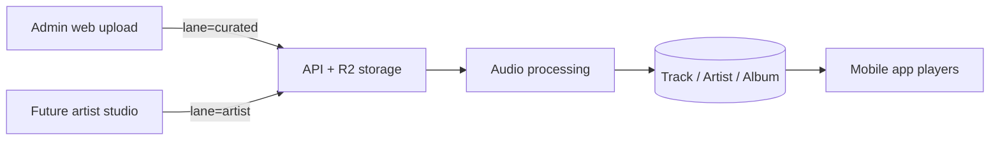
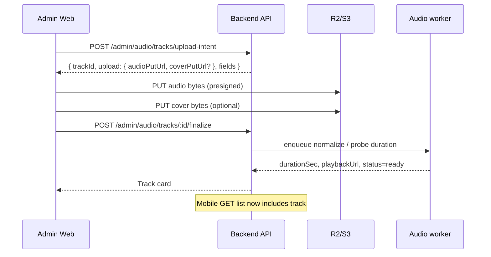

# Backend Handoff — Copyright-Free Audio + Future “Jevah for Artists”

**Audience:** `jevahapp-backend`  
**From:** Jevah web admin frontend  
**Date:** 29 July 2026  
**Priority:** Critical for app music surface; foundation for future artist catalog (“Spotify for gospel / God-oriented music”)

This document is the **source of truth** for aligning backend storage, APIs, and admin/mobile clients so music works end-to-end — without painting us into a corner when Artists launches.

---

## 0. Product vision (read this first)

### Today (Phase 1) — Jevah curated library

Admins upload **copyright-free / Jevah-owned** tracks in the web dashboard.  
Those tracks appear in the **mobile app** under a curated “Copyright-free” / worship-background / listen surface.

### Tomorrow (Phase 2) — Jevah for Artists

Jevah registers **gospel / God-oriented artists**, their catalogs, genres, albums, and streams — a Spotify-like experience for faith music.

### Architectural rule

**One media + catalog system, two distribution lanes:**

| Lane | `source` / ownership | Who uploads | App surface |
|------|----------------------|-------------|-------------|
| **Curated** | `lane: "curated"` | Super-admin / admin | Copyright-free / Jevah picks |
| **Artist** | `lane: "artist"` | Verified artist (or admin on behalf) | Artist profiles, albums, radio, search |

Do **not** invent a second unrelated “songs” table later. Phase 1 should create the **Track** (or extend existing copyright-free model into a proper Track) that Phase 2 reuses.



---

## 1. What frontend already has (done)

### 1.1 Admin UI

| Item | Status |
|------|--------|
| Route `/admin/audio` | Done |
| Nav item “Audio library” | Done |
| List songs (cards + audio player) | Done |
| Create / edit / delete | Done — **URL-based only** |
| Confirm delete + toasts | Done |

**File:** `src/pages/admin/AudioLibrary.tsx`  
**API client:** `src/services/adminApi.ts`

### 1.2 APIs frontend calls today

| Method | Path | Body (create/update) |
|--------|------|----------------------|
| GET | `/api/audio/copyright-free` | — |
| POST | `/api/audio/copyright-free` | `{ title, singer, fileUrl, thumbnailUrl?, category?, duration? }` |
| PUT | `/api/audio/copyright-free/:songId` | same fields |
| DELETE | `/api/audio/copyright-free/:songId` | — |

### 1.3 Gap (why it’s not “functional upload” yet)

Admin currently pastes **`fileUrl` / `thumbnailUrl` strings**.  
There is **no multipart / presigned upload** from the browser to R2/S3.

For a real workflow we need:

1. Admin picks local audio (+ cover)  
2. Backend issues **presigned upload URL(s)** (or accepts multipart)  
3. Browser uploads bytes to storage  
4. Backend **finalizes** track → returns playable CDN/app URL  
5. Mobile lists & streams that track  

---

## 2. Phase 1 goal (ship this first)

> Admin can upload a copyright-free song from the dashboard; it appears in the mobile app within seconds; playback works offline-cache-friendly later; deletes remove storage objects.

### Success criteria

1. Admin uploads `.mp3` / `.m4a` / `.wav` (+ optional cover image) without pasting URLs  
2. Track appears in `GET` list with `playbackUrl` (or signed) + `thumbnailUrl`  
3. Mobile app shows track in curated library without code change beyond pointing at the same endpoints  
4. Delete removes DB row **and** audio/cover objects  
5. Audit log: `create_track` / `update_track` / `delete_track`  
6. Schema includes `lane: "curated"` so Phase 2 can add `lane: "artist"` without migration pain  

---

## 3. Recommended data model (Phase 1 + Phase 2 ready)

### 3.1 `Track` (canonical song document)

Prefer evolving today’s copyright-free collection into this shape (or add `Track` and migrate).

```ts
type TrackLane = "curated" | "artist";
type TrackVisibility = "draft" | "published" | "archived";
type AudioProcessingStatus = "pending" | "processing" | "ready" | "failed";

interface Track {
  id: string;

  // Catalog
  title: string;
  artistName: string;          // display name (curated: free-text; artist: denormalized)
  artistId?: string | null;    // Phase 2 FK → Artist
  albumId?: string | null;     // Phase 2
  genre?: string | null;       // e.g. gospel, worship, afro-gospel, hymn
  category?: string | null;    // curated buckets: background, kids, prayer, ...
  language?: string | null;    // en, yo, ig, ha, fr, ...
  durationSec?: number | null;
  bpm?: number | null;         // optional later
  isrc?: string | null;        // Phase 2

  // Ownership / distribution
  lane: TrackLane;             // "curated" for Phase 1
  visibility: TrackVisibility;
  copyrightStatus: "copyright_free" | "licensed" | "original" | "unknown";
  licenseNote?: string | null; // e.g. "CC0", "Jevah owned", "Artist exclusive"

  // Media
  audio: {
    originalKey: string;       // R2/S3 key
    originalUrl?: string;      // optional public
    playbackUrl: string;       // what clients play (CDN or signed)
    format?: string;           // audio/mpeg
    bitrateKbps?: number;
    fileSizeBytes?: number;
    signed?: boolean;
    expiresInSeconds?: number | null;
  };
  artwork?: {
    key?: string;
    url: string | null;
  } | null;

  processing: {
    status: AudioProcessingStatus;
    error?: string | null;
    waveformUrl?: string | null; // optional
    updatedAt?: string;
  };

  // Stats (Phase 2 heavy; Phase 1 can stub zeros)
  stats: {
    playCount: number;
    likeCount: number;
    shareCount: number;
  };

  // Admin
  createdByAdminId?: string;
  publishedAt?: string | null;
  createdAt: string;
  updatedAt: string;
}
```

### 3.2 Phase 2 entities (define now, implement later)

```ts
interface Artist {
  id: string;
  userId?: string;             // linked User with role artist
  displayName: string;
  slug: string;
  bio?: string;
  avatarUrl?: string;
  genres: string[];
  isVerified: boolean;         // sync with User.isVerifiedArtist
  status: "pending" | "active" | "suspended";
  socials?: { spotify?: string; youtube?: string; instagram?: string };
  createdAt: string;
}

interface Album {
  id: string;
  artistId: string;
  title: string;
  coverUrl?: string;
  releaseDate?: string;
  trackIds: string[];
  visibility: "draft" | "published";
}
```

**Phase 1:** `artistId` / `albumId` nullable; `artistName` required string.  
**Phase 2:** when an Artist is registered, curated tracks can optionally be linked; new uploads set `lane: "artist"`.

---

## 4. Storage & processing architecture

### 4.1 Storage

Use the same object store as media (R2 / S3):

```
audio/curated/{trackId}/original.{ext}
audio/curated/{trackId}/cover.{ext}
audio/artist/{artistId}/{trackId}/original.{ext}   // Phase 2
```

### 4.2 Upload pattern (recommended): **presigned PUT**

Avoid streaming large files through the Node API.



### 4.3 Processing (minimum Phase 1)

On finalize:

1. HEAD/probe file exists  
2. Read duration (ffprobe or similar)  
3. Optionally normalize to AAC/MP3 for playback  
4. Set `processing.status = "ready"` and `visibility = "published"` (or leave draft until admin publishes)  
5. Emit audit + optional feed event `upload` / `admin_action`

### 4.4 Playback URLs

| Environment | Recommendation |
|-------------|----------------|
| Curated public library | Long-lived CDN URL or public R2 (simplest for Phase 1) |
| Private / artist exclusives (Phase 2) | Signed URLs + refresh (same pattern as moderation media) |

For Phase 1 curated copyright-free, **public playback URLs are fine** and keep mobile simple.

---

## 5. Exact APIs — Phase 1 (implement these)

Base: `Authorization: Bearer <admin JWT>` on `/api/admin/*`.  
Keep legacy `/api/audio/copyright-free` working as **aliases** during migration.

### 5.1 Admin list (paginated)

```http
GET /api/admin/audio/tracks?lane=curated&search=&category=&visibility=&page=1&limit=20
```

```json
{
  "success": true,
  "data": {
    "items": [ /* TrackCard[] */ ],
    "pagination": { "page": 1, "limit": 20, "total": 42, "pages": 3 }
  }
}
```

**TrackCard** (stable for admin + mobile):

```ts
type TrackCard = {
  id: string;
  title: string;
  artistName: string;
  category: string | null;
  genre: string | null;
  durationSec: number | null;
  lane: "curated" | "artist";
  visibility: "draft" | "published" | "archived";
  copyrightStatus: string;
  playbackUrl: string | null;
  thumbnailUrl: string | null;
  processingStatus: "pending" | "processing" | "ready" | "failed";
  playCount: number;
  createdAt: string;
  updatedAt: string;
};
```

### 5.2 Upload intent

```http
POST /api/admin/audio/tracks/upload-intent
Content-Type: application/json

{
  "title": "Still Waters",
  "artistName": "Jevah Worship",
  "category": "worship",
  "genre": "gospel",
  "language": "en",
  "copyrightStatus": "copyright_free",
  "licenseNote": "Jevah owned / CC0",
  "lane": "curated",
  "contentType": "audio/mpeg",
  "fileName": "still-waters.mp3",
  "fileSizeBytes": 5242880,
  "coverContentType": "image/jpeg",
  "coverFileName": "cover.jpg"
}
```

**Response:**

```json
{
  "success": true,
  "data": {
    "trackId": "…",
    "audio": {
      "putUrl": "https://…presigned…",
      "key": "audio/curated/…/original.mp3",
      "headers": { "Content-Type": "audio/mpeg" },
      "expiresInSeconds": 900
    },
    "cover": {
      "putUrl": "https://…",
      "key": "audio/curated/…/cover.jpg",
      "headers": { "Content-Type": "image/jpeg" },
      "expiresInSeconds": 900
    } | null
  }
}
```

**Validation:**

- Max audio size (e.g. 50–100 MB)  
- Allowed types: `audio/mpeg`, `audio/mp4`, `audio/wav`, `audio/x-m4a`  
- Cover: `image/jpeg`, `image/png`, `image/webp`, max ~5 MB  
- Rate limit per admin  

Creates a **draft** track row with `processing.status = "pending"`.

### 5.3 Finalize after browser PUT

```http
POST /api/admin/audio/tracks/:trackId/finalize
{
  "publish": true
}
```

- Verifies objects exist  
- Enqueues processing  
- If `publish: true` and probe succeeds → `visibility: "published"`  
- Returns full `TrackCard`

### 5.4 CRUD updates

```http
GET    /api/admin/audio/tracks/:id
PATCH  /api/admin/audio/tracks/:id
{
  "title": "…",
  "artistName": "…",
  "category": "…",
  "genre": "…",
  "language": "…",
  "visibility": "published",
  "licenseNote": "…",
  "copyrightStatus": "copyright_free"
}
DELETE /api/admin/audio/tracks/:id
```

DELETE: soft-archive **or** hard-delete + purge R2 keys (prefer hard delete for curated mistakes; soft for artist catalogs later). Document which.

### 5.5 Replace audio / replace cover (optional but valuable)

```http
POST /api/admin/audio/tracks/:id/replace-audio/intent
POST /api/admin/audio/tracks/:id/replace-audio/finalize
POST /api/admin/audio/tracks/:id/replace-cover/intent
POST /api/admin/audio/tracks/:id/replace-cover/finalize
```

### 5.6 Public / app consumption (mobile)

Keep a **stable public (or user-auth) list** for the app:

```http
GET /api/audio/copyright-free?page=&limit=&category=&search=
GET /api/audio/copyright-free/:id
```

**Contract:** Only return `visibility: "published"` + `lane: "curated"` + `processing.status: "ready"`.

Response items must include:

- `id`, `title`, `singer` **or** `artistName` (support both during transition)  
- `fileUrl` **or** `playbackUrl` (alias both for old clients)  
- `thumbnailUrl`  
- `duration` / `durationSec`  
- `category`

### 5.7 Legacy alias map (don’t break current web admin)

| Legacy | New |
|--------|-----|
| GET `/api/audio/copyright-free` | → list curated published (app) **or** if admin token, can keep as thin list |
| POST `/api/audio/copyright-free` `{ fileUrl }` | → create Track from existing URL (compat) **and/or** 410 with message to use upload-intent |
| PUT/DELETE | → map to Track |

**Recommendation:** Keep URL-based POST for 1–2 releases as fallback; primary path = upload-intent.

---

## 6. Mobile app contract (so it “reflects in app”)

Mobile should treat curated library as:

```http
GET /api/audio/copyright-free?limit=50
```

Player uses `playbackUrl || fileUrl`.  
When a new track is published, next pull-to-refresh / app resume shows it.  

Optional Phase 1.5:

```http
GET /api/audio/copyright-free?updatedSince=ISO
```

or Socket / push later — not required for v1.

---

## 7. Frontend plan (what we will build once APIs land)

### 7.1 Immediate UI upgrade (Phase 1)

Replace URL paste form with:

1. **Dropzone** — audio file required, cover optional  
2. Progress bar for PUT uploads  
3. Fields: title, artist name, category, genre, language, license note  
4. States: Draft / Processing / Ready / Failed  
5. Publish toggle  
6. Inline player using `playbackUrl` when ready  

### 7.2 Future Artists admin (Phase 2 UI sketch)

```
/admin/artists          → list / verify / suspend
/admin/artists/:id      → profile, albums, tracks
/admin/audio            → tabs: Curated | Artist catalog | All
```

Artist studio (mobile or web) later uploads with `lane: "artist"` + `artistId`.

---

## 8. Phase 2 API sketch (don’t implement all now — freeze shapes)

```http
# Artists
POST   /api/admin/artists                 # register artist
GET    /api/admin/artists
PATCH  /api/admin/artists/:id
PATCH  /api/admin/artists/:id/verification { "isVerified": true }

# Albums
POST   /api/admin/albums
PATCH  /api/admin/albums/:id

# Artist-lane tracks (same Track collection)
POST   /api/admin/audio/tracks/upload-intent  { "lane": "artist", "artistId": "…" }

# App-facing
GET    /api/music/home                    # curated + featured artists
GET    /api/music/search?q=
GET    /api/artists/:slug
GET    /api/artists/:slug/tracks
POST   /api/music/tracks/:id/play         # increment playCount (auth)
```

Streaming analytics, playlists, likes — Phase 2+.

---

## 9. Security & rights (critical)

| Rule | Detail |
|------|--------|
| Admin-only mutations | `requireAdmin` on upload-intent / finalize / delete |
| Master optional | Only master can delete published curated tracks (product choice) |
| License metadata | Require `copyrightStatus` + optional `licenseNote` for curated |
| Virus / type sniff | Validate Content-Type + magic bytes on finalize |
| No open proxy | Presigned URLs scoped to exact key + content-type |
| Artist Phase 2 | Artists only upload to their `artistId`; admins can override |
| Takedown | `visibility: "archived"` hides from app immediately |

---

## 10. What backend should implement this sprint (checklist)

### P0 — Make curated upload real

- [ ] `Track` model (or migrate copyright-free → Track) with `lane: "curated"`  
- [ ] `POST /api/admin/audio/tracks/upload-intent`  
- [ ] Presigned PUT to R2/S3  
- [ ] `POST /api/admin/audio/tracks/:id/finalize` + duration probe  
- [ ] `GET /api/admin/audio/tracks` paginated admin list  
- [ ] `PATCH` / `DELETE` with storage cleanup  
- [ ] App `GET /api/audio/copyright-free` returns **only published+ready** curated tracks with `playbackUrl`/`fileUrl` aliases  
- [ ] Audit events  

### P1 — Polish

- [ ] Replace cover / replace audio intents  
- [ ] Processing status polling or include status on list  
- [ ] Categories enum documented  
- [ ] OpenAPI examples  

### P2 — Artists foundation (schema only OK)

- [ ] `Artist` collection stub + admin CRUD  
- [ ] `Track.artistId` nullable FK  
- [ ] Do **not** fork a second song system  

---

## 11. Example category / genre enums (align mobile filters)

**Categories (curated buckets):**

`worship` · `praise` · `prayer` · `background` · `kids` · `instrumental` · `sermon_bed` · `seasonal`

**Genres (cross-lane):**

`gospel` · `contemporary_christian` · `afro_gospel` · `hymn` · `choir` · `rap_gospel` · `highlife_gospel` · `other`

Backend should accept string enums; reject unknown if you want strictness.

---

## 12. Compatibility shims for current frontend (until UI ships upload)

Until web is updated to presigned flow, either:

**A.** Keep accepting:

```json
POST /api/audio/copyright-free
{ "title", "singer", "fileUrl", "thumbnailUrl?", "category?", "duration?" }
```

and store as Track with `lane: "curated"`, `copyrightStatus: "copyright_free"`.

**B.** Or return `400` with message: use upload-intent — and we ship UI same day.

Prefer **A** during transition.

Field aliases to accept forever on read:

| Preferred | Alias |
|-----------|--------|
| `artistName` | `singer` |
| `playbackUrl` | `fileUrl` |
| `durationSec` | `duration` |
| `thumbnailUrl` | `coverUrl` / `artwork.url` |
| `id` | `_id` |

---

## 13. Definition of done (Phase 1)

An admin on production:

1. Opens `/admin/audio`  
2. Drops an MP3 + cover  
3. Sees processing → ready  
4. Opens mobile app curated music → song plays  

No manual URL pasting. No orphan files in R2. No unpublished drafts leaking to mobile.

---

## 14. What we need back from backend

Please reply with:

1. Confirmation of Track model (or diff vs current copyright-free schema)  
2. Presigned upload: R2 vs S3 + max sizes  
3. Draft OpenAPI for upload-intent + finalize + admin list  
4. Whether app already consumes `/api/audio/copyright-free` (field names in mobile)  
5. ETA for P0 so frontend can ship the dropzone UI in lockstep  

---

## 15. Bottom line

| Layer | Status |
|-------|--------|
| Admin list UI | Exists (URL CRUD) |
| Real file upload | **Blocked on backend presign + finalize** |
| App reflection | Needs published curated tracks via existing/public list |
| Future Artists Spotify | Design for **one Track model + lane**; don’t build a second library |

**Best path:** Implement Phase 1 upload pipeline on a forward-compatible `Track` with `lane: "curated"`. Frontend will replace the paste-URL form with a proper uploader the same week those endpoints are live. Phase 2 then adds `Artist` / `Album` and `lane: "artist"` without rewriting storage or players.
